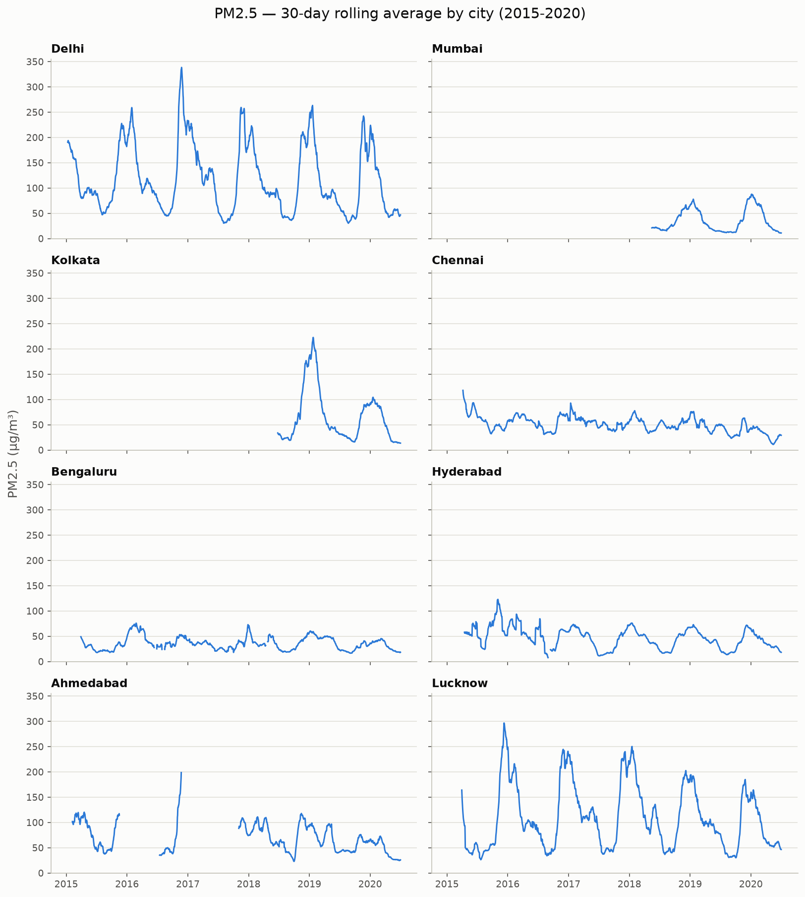
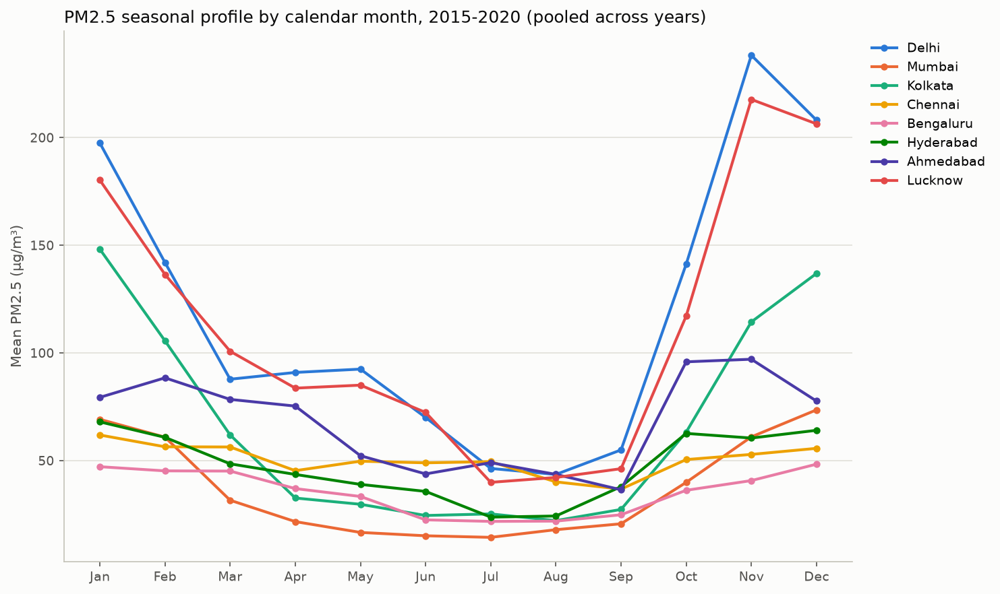
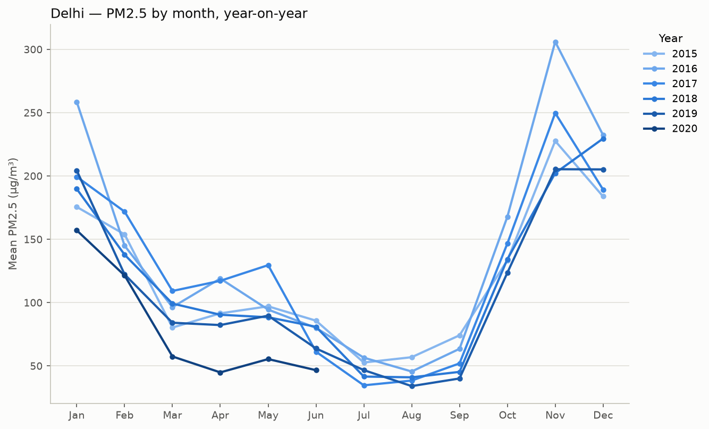
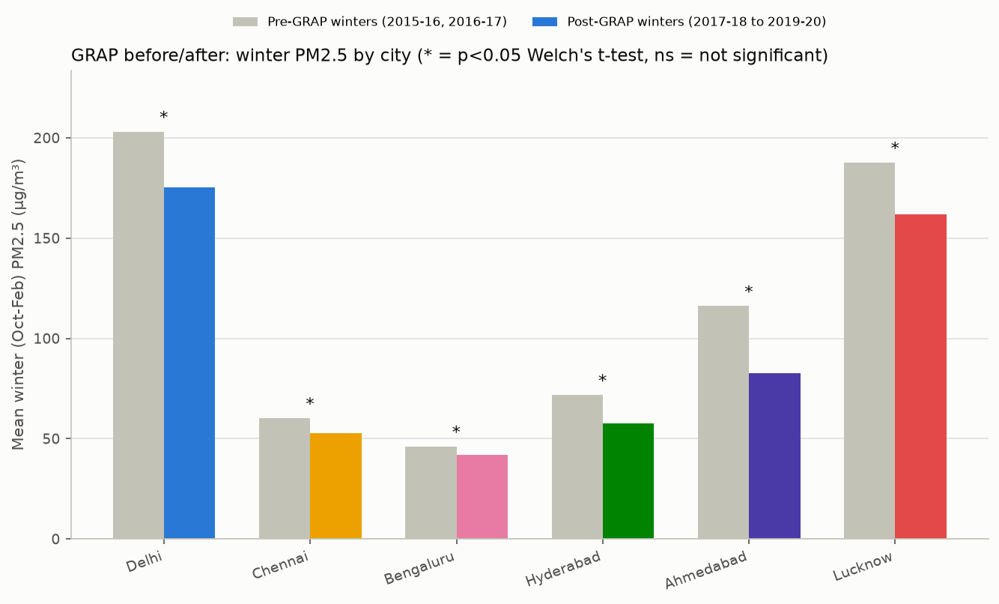

# Urban Air Quality Trend & Policy Impact Analysis (CPCB)

[](https://github.com/deepanshuA04/air-quality-analysis/actions/workflows/ci.yml)

Cleaning, SQL aggregation, and time-series analysis of hourly CPCB air-quality
data for 8 Indian cities, plus a before/after test of a real air-quality
policy (Delhi's GRAP). Python/Pandas for cleaning, SQLite for the
aggregation layer, Power BI for the dashboard.

## Recommendation

Enforcement and public advisories should be concentrated in October through
February. Average PM2.5 across the 8 cities is 123% higher in that window
than the rest of the year, and the pattern holds in every year of data from
2015-2020 — it's not one bad winter skewing the average. Delhi breaches the
CPCB 24-hour PM2.5 standard on 73% of measured days; Bengaluru breaches it
on 9.6%. That gap is too large for a one-size-fits-all national advisory
calendar — the winter push matters most for Delhi, Lucknow, Kolkata and
Ahmedabad (63-259% winter increase), much less for Chennai and Bengaluru
(18-45%).

One important caveat on the policy side: Delhi's winter PM2.5 dropped
significantly after GRAP started enforcement in Oct 2017 (-13.8%,
p<0.001), but so did five other cities where GRAP was never implemented —
two of them by more than Delhi. That doesn't mean GRAP failed, but it does
mean this data can't show that GRAP caused Delhi's improvement. Details in
[Hypothesis testing](#hypothesis-testing-did-grap-change-delhis-winter-pm25)
below.

Every number here comes out of the scripts in `scripts/` — see
[Reproducing this analysis](#reproducing-this-analysis) to regenerate all
of it from the raw CSV.

## Dataset

| | |
|---|---|
| Source | [Air Quality Data in India (2015-2020)](https://www.kaggle.com/datasets/rohanrao/air-quality-data-in-india) by rohanrao on Kaggle, compiled from CPCB's public monitoring network |
| Files used | `city_hour.csv` (hourly, city-level), `city_day.csv` (daily, used for cross-checking), `stations.csv` |
| Downloaded | 2026-08-12 |
| License | CC0-1.0 (public domain) |
| Getting the data | `uv run python scripts/download_data.py` (needs a Kaggle API token — see [Kaggle API docs](https://www.kaggle.com/docs/api)). Files are checksummed against `data/raw/CHECKSUMS.sha256`. |

The project was originally scoped for 2019-2024 across 8 cities. The real
file covers **2015-01-01 to 2020-07-01** — CPCB's own hourly aggregation
(and this Kaggle mirror of it) doesn't go past mid-2020. Rather than force
the numbers to match the original plan, the analysis below uses the real
window and says so.

Of the 26 cities in the raw file, coverage varies a lot — some run the full
5.5 years, others start partway through. The 8 used here are the ones with
the longest, most complete series, which also happens to give reasonable
geographic spread:

**Delhi, Mumbai, Kolkata, Chennai, Bengaluru, Hyderabad, Ahmedabad, Lucknow**

| City | Hourly rows | Date range | PM2.5 completeness |
|---|---|---|---|
| Delhi | 48,192 | 2015-01-01 → 2020-07-01 | 99.2% |
| Mumbai | 48,192 | 2015-01-01 → 2020-07-01 | 37.7% |
| Chennai | 48,192 | 2015-01-01 → 2020-07-01 | 93.1% |
| Bengaluru | 48,192 | 2015-01-01 → 2020-07-01 | 90.4% |
| Ahmedabad | 48,192 | 2015-01-01 → 2020-07-01 | 64.6% |
| Lucknow | 48,192 | 2015-01-01 → 2020-07-01 | 93.4% |
| Hyderabad | 48,107 | 2015-01-04 → 2020-07-01 | 92.5% |
| Kolkata | 19,503 | 2018-04-10 → 2020-07-01 | 92.6% |

That's 356,762 city-hour rows, or about 3.26 million individual pollutant
readings once melted to one row per city-hour-pollutant across the 12
pollutants tracked (PM2.5, PM10, NO, NO2, NOx, NH3, CO, SO2, O3, Benzene,
Toluene, Xylene) — comfortably above the original 1.2M+ target, just over a
shorter and earlier window than planned.

## Data-quality profile

Built by `uv run python scripts/build_quality_profile.py`, on the raw data
before any cleaning runs. Full detail in
`reports/quality_profile_full.csv` (540 city × pollutant × year rows).

By city, across all 12 pollutants and all years in that city's window:

| City | Expected hours | Non-null readings | % missing | Impossible values |
|---|---|---|---|---|
| Delhi | 578,304 | 549,490 | 4.98% | 0 |
| Hyderabad | 577,284 | 536,842 | 7.01% | 0 |
| Kolkata | 234,036 | 216,260 | 7.60% | 0 |
| Bengaluru | 578,304 | 475,666 | 17.75% | 0 |
| Chennai | 578,304 | 445,889 | 22.90% | 0 |
| Lucknow | 578,304 | 420,409 | 27.30% | 0 |
| Ahmedabad | 578,304 | 329,690 | 42.99% | 2,978 (all CO) |
| Mumbai | 578,304 | 286,080 | 50.53% | 0 |

PM10 and Xylene are the worst-covered pollutants (52% and 60% missing);
CO, NOx and Benzene are the best (9-13%). PM2.5, the pollutant most of this
analysis centers on, is 17.8% missing overall.

The only impossible values found are 2,978 CO readings in Ahmedabad, 0.9%
of its CO data, above the 50 mg/m³ ceiling used here (CPCB's 24h CO
standard is 2 mg/m³, so anything above 50 in ambient air is an instrument
fault, not a real reading — see `config.PLAUSIBLE_CEILING`). No negative
values anywhere, and no exact-zero PM2.5/PM10 readings in this file — the
rule for treating a zero particulate reading as "sensor off" is
implemented and tested but doesn't actually fire on this data.

One gap worth calling out directly: Mumbai's PM2.5 sensor has zero
readings for 2015-2017, and only starts reporting in 2018. That's the
whole reason Mumbai's completeness number above (37.7%) is so much worse
than cities with a similar row count — it's a real station-startup gap,
not something to interpolate over.

### Cleaning rules

| Rule | Function | Why |
|---|---|---|
| Impossible values → missing | `cleaning.flag_impossible_values` | Negative concentrations can't exist; values above a per-pollutant ceiling (`config.PLAUSIBLE_CEILING`) are instrument faults, not readings; exact-zero PM2.5/PM10 means the particulate sensor was off (ambient PM is never truly zero) — this only applies to PM2.5/PM10 because gases legitimately read zero near their detection limit. |
| Short gaps (≤6h) → interpolated | `cleaning.interpolate_short_gaps` | A few missing hours is well approximated by a straight line between the readings on either side. |
| Long gaps (>6h) → left missing | `cleaning.interpolate_short_gaps` | Interpolating across a multi-day outage would just be making up data. Left as `NaN` with a `missing_long_gap` flag. |
| Outliers → flagged, not dropped | `cleaning.flag_outliers_iqr` | IQR fences are computed per city, per pollutant, per calendar month — not one global threshold. Delhi's winter PM2.5 routinely sits at 300-900 µg/m³, which a global fence would flag on almost every winter night. A per-month fence judges each city against its own seasonal baseline. Flagged values are kept, since "unusual for this city in this month" isn't the same as "wrong." |

Running `uv run python scripts/clean_and_load.py` applies these three
rules in order (impossible → interpolate → outlier flag) to all 4,281,144
city-hour-pollutant rows and loads the result into SQLite:

| `quality_flag` | Rows | % |
|---|---|---|
| `ok` | 3,075,675 | 71.84% |
| `missing_long_gap` | 991,126 | 23.15% |
| `outlier_seasonal` | 181,673 | 4.24% |
| `interpolated` | 32,670 | 0.76% |

Most of that 23% missing comes from the low-uptime pollutants/cities
already visible in the profile above (PM10, Xylene, Mumbai pre-2018).

## SQL layer

`sql/views.sql` holds the aggregation logic — daily/monthly averages,
rolling windows, exceedance days — so both the Python EDA and the Power BI
dashboard read from the same view instead of two separate implementations.
Applied automatically at the end of `clean_and_load.py`.

| View | Computes |
|---|---|
| `v_city_pollutant_daily` | Daily average per city+pollutant; `NULL` unless ≥18 of 24 hours are present that day |
| `v_city_pollutant_daily_rolling30` | 30-day trailing rolling average (window function over the daily view) |
| `v_city_pollutant_monthly` | Monthly average per city+pollutant |
| `v_city_pollutant_monthly_mom` | Month-over-month change via `LAG()` |
| `v_city_monthly_profile` | Average by calendar month, pooled across years — the seasonal profile |
| `v_pm25_exceedance_days` | Per-day flag for PM2.5 > 60 µg/m³ (CPCB 24h standard) |
| `v_pm25_exceedance_summary` | Per-city exceedance-day count and % |

Delhi exceeds the standard on 73% of valid days, Lucknow on 67%, versus
9.6% for Bengaluru — more on this below.

## Time-series EDA

Generated by `uv run python scripts/run_eda.py`.

### 30-day rolling average, PM2.5



One panel per city rather than 8 overlapping lines — with this many
series, small multiples are just easier to read. The gaps in Mumbai,
Kolkata and part of Ahmedabad's series are the same coverage holes from
the data-quality profile, left blank rather than bridged (they're
multi-month gaps, well past the 6-hour interpolation cutoff).

### Seasonal profile



Instead of assuming an October-January window, this takes whichever
calendar months have a pooled PM2.5 average above the pooled annual mean.
That comes out to **October through February** — a month later than
originally assumed, because February (87 µg/m³ pooled) is still clearly
elevated above October (76) before the drop into March.

### Winter spike by city

| City | Winter mean | Non-winter mean | % increase |
|---|---|---|---|
| Kolkata | 113.8 | 31.7 | +258.7% |
| Mumbai | 61.4 | 19.3 | +217.8% |
| Delhi | 184.8 | 71.3 | +159.1% |
| Lucknow | 172.1 | 68.5 | +151.2% |
| Hyderabad | 63.3 | 36.5 | +73.3% |
| Ahmedabad | 88.4 | 54.1 | +63.2% |
| Bengaluru | 43.5 | 30.0 | +45.4% |
| Chennai | 55.5 | 46.9 | +18.4% |

Averaged across all 8 cities the winter mean is 123% above the non-winter
mean (`reports/winter_spike_by_city.csv`), but that single number hides a
real split: Kolkata, Delhi, Lucknow and Mumbai all see well over 150%,
while Chennai and Bengaluru barely have a winter season in their PM2.5 at
all.

### Year-on-year: recurring pattern, or one bad winter?



Every one of Delhi's 6 years shows the same October-February rise and
July-August trough. It's a structural seasonal pattern, not a single year
dragging up the average. (2020 stops in July because that's where the raw
file's coverage ends, not because the pattern changed.)

## Hypothesis testing: did GRAP change Delhi's winter PM2.5?

**The intervention:** Delhi-NCR's Graded Response Action Plan (GRAP),
notified 17 Jan 2017 and operationally enforced from 17 Oct 2017
([source](https://www.cseindia.org/graded-response-action-plan-to-control-air-pollution-in-delhi-ncr-in-very-poor-and-severe-categories-comes-into-effect-from-october-17-2017-says-epca-8506)).
It applies only to Delhi-NCR, so of the 8 cities studied, only Delhi is
actually covered by the policy.

**Method:** Welch's t-test on daily PM2.5 in the same Oct-Feb window every
year, so season doesn't confound the comparison — 2 pre-GRAP winters
(2015-16, 2016-17) against 3 post-GRAP winters (2017-18 through 2019-20).
The same test is run for all 8 cities, not just Delhi, since most of them
were never under GRAP — that turns the other 7 into a rough sanity check
on whether "Delhi improved" really is a GRAP story. Run by
`uv run python scripts/run_stats.py`.



| City | Under GRAP? | n (pre / post) | Mean pre | Mean post | % change | p-value | Cohen's d |
|---|---|---|---|---|---|---|---|
| Delhi | Yes | 302 / 454 | 203.1 | 175.2 | -13.8% | 0.00002 | -0.32 |
| Lucknow | No | 297 / 454 | 187.7 | 161.8 | -13.8% | 0.00001 | -0.34 |
| Ahmedabad | No | 58 / 402 | 116.1 | 82.5 | -28.9% | 0.00044 | -0.86 |
| Hyderabad | No | 288 / 446 | 71.8 | 57.8 | -19.5% | 0.00001 | -0.40 |
| Chennai | No | 275 / 454 | 60.2 | 52.6 | -12.7% | 0.00035 | -0.27 |
| Bengaluru | No | 288 / 447 | 46.2 | 41.9 | -9.3% | 0.0103 | -0.20 |
| Mumbai | No | 0 / 291 | — | 61.4 | — | insufficient pre-GRAP data | — |
| Kolkata | No | 0 / 303 | — | 113.8 | — | insufficient pre-GRAP data | — |

Full output in `reports/grap_before_after.csv`. Ahmedabad's pre-GRAP
sample is real but thin (58 days against ~300 for the other testable
cities), a consequence of the same coverage gaps in the data-quality
profile — worth weighting that result accordingly. Mumbai and Kolkata
can't be tested at all: both have zero valid PM2.5 days in the pre-GRAP
window (Mumbai's sensor wasn't reporting yet; Kolkata's station didn't
exist until April 2018).

**One-way ANOVA** across all 8 cities, full study period: F = 607.8,
p < 0.001, η² = 0.26 — city explains about a quarter of the variance in
daily PM2.5. Group means range from ~35 µg/m³ (Bengaluru, Mumbai) to 118
(Delhi) and 110 (Lucknow); full table in `reports/anova_pm25_group_means.csv`.

**Reading the GRAP result honestly:** every one of the 6 testable cities
shows a statistically significant winter PM2.5 decrease after Oct 2017,
including five where GRAP never applied — and Delhi's decline (-13.8%) is
smaller than Ahmedabad's (-28.9%) or Hyderabad's (-19.5%), neither of
which had any GRAP-style policy. That's not proof GRAP did nothing, but it
does mean a plain before/after comparison can't separate a GRAP effect
from whatever else was driving pollution down across most of urban India
in this period — could be weather variation between the two specific
pre-GRAP winters, a broader national trend, or changes in the monitoring
network itself.

This is also just an observational before/after comparison, not a
controlled experiment, so a few things it genuinely can't tell you:
weather wasn't controlled for; the COVID-19 lockdown (from 25 Mar 2020)
falls inside the post-GRAP window and suppressed emissions for reasons
that have nothing to do with GRAP; other overlapping policies (odd-even
rationing, the 2017 firecracker restrictions, BS-VI fuel from Apr 2020)
can't be separated out with this method; and CPCB's monitoring network
changed during this period too (new stations coming online, visible
directly in Kolkata's and Mumbai's coverage gaps), which can shift a
city's measured average independent of actual air quality. "GRAP reduced
Delhi's PM2.5 by 13.8%" is more than this analysis can support on its own.

## Power BI dashboard

Not built yet — Power BI Desktop is a GUI tool with no scriptable path, so
this needs to be done by hand rather than by a script. The data is ready:
`uv run python scripts/export_powerbi_views.py` exports every SQL view to
`powerbi/data/*.csv`, so the dashboard reads metric definitions from SQL
instead of redoing them in DAX. Planned: a city comparison page (trend
lines + exceedance counts), a single-city drill-down (rolling average +
seasonal profile), and a GRAP before/after page. Screenshots and the
`.pbix` go here once it exists.

## Limitations

- The statistical toolkit is intentionally basic — rolling averages,
  year-on-year comparison, t-tests, one-way ANOVA. No seasonal
  decomposition, no ARIMA, no causal-inference framework
  (difference-in-differences, synthetic control). The seasonal pattern is
  obvious enough without a decomposition model; a real causal estimate of
  GRAP's effect would need weather/traffic controls this dataset doesn't
  have, and that's out of scope here rather than faked with a simpler test.
- No multiple-comparisons correction across the 6 GRAP t-tests — at
  α=0.05 across 6 tests there's some chance of a false positive by
  construction, though all 6 agreed in direction and 5 were significant at
  p<0.02. Left uncorrected as a scope decision, not because it's the
  statistically ideal approach.
- The 8 cities are the ones with the best data coverage in the source
  file, not a random sample — the findings describe these 8 specifically.
- PM2.5 is the focus pollutant. The other 11 (PM10, NO, NO2, NOx, NH3, CO,
  SO2, O3, Benzene, Toluene, Xylene) are cleaned and queryable but not
  deeply analyzed here.
- Gaps over 6 hours are left missing rather than filled, so every average
  here is computed only from the hours actually measured. If sensors are
  more likely to fail during the worst pollution events, the real winter
  spike could be larger than what's reported.

## Reproducing this analysis

```bash
uv sync --frozen
uv run python scripts/download_data.py    # fetch raw CSVs once (needs a Kaggle API token)
uv run python scripts/run_pipeline.py     # profile -> clean -> SQLite -> SQL views ->
                                           # EDA figures -> hypothesis tests -> Power BI export
```

`run_pipeline.py` chains these, each independently runnable:

```bash
uv run python scripts/build_quality_profile.py
uv run python scripts/clean_and_load.py
uv run python scripts/run_eda.py
uv run python scripts/run_stats.py
uv run python scripts/export_powerbi_views.py
```
